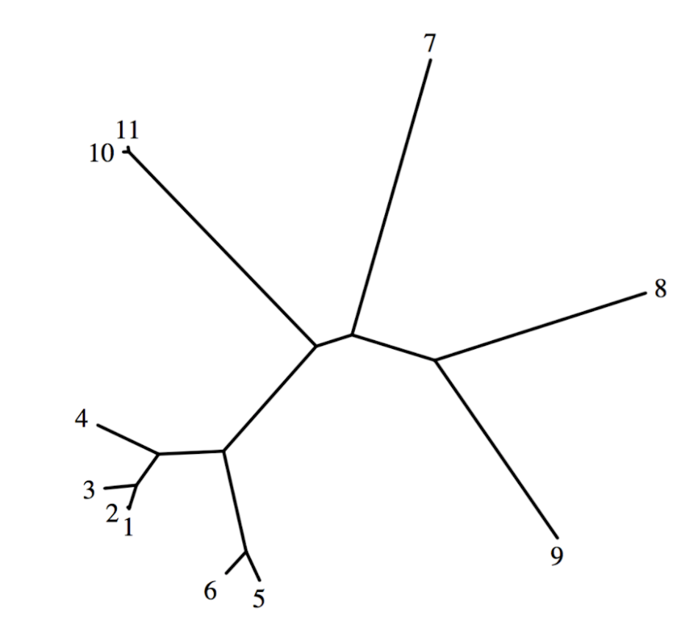

# phylogenetic-tree-generation

In this project I implemented the Neighbor-Joining and UPGMA algorithms. I used Neighbor-Joining to construct phylogenetic trees from protein sequence data. 

### Phylogenetic tree showing SARS spike proteins from various species.

The SARS virus crossed species to enter humans, so this project helped identify from which species that "jump" occurred.

